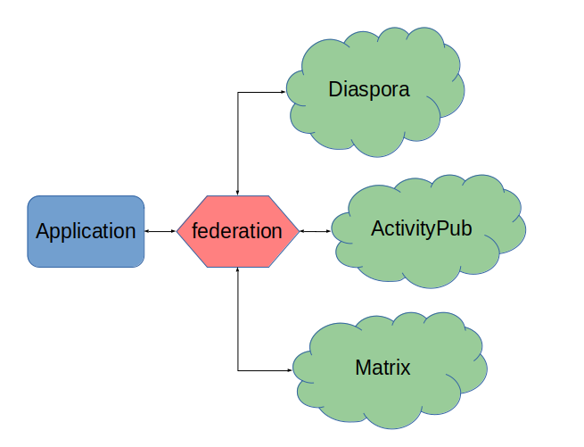

Introduction
============

The aim of ``federation`` is to provide and abstract multiple social web protocols like
ActivityPub and Diaspora in one package, over an easy to use and understand Python API.
This way applications can be built to (almost) transparently support many protocols
without the app builder having to know everything about those protocols.

Status
------

Currently three protocols are being focused on.

* Diaspora is considered to be stable with most of the protocol implemented.
* ActivityPub support should be considered as alpha - all the basic
  things work but there are likely to be a lot of compatibility issues with other ActivityPub
  implementations.
* Matrix support cannot be considered usable as of yet.

The code base is well tested and in use in several projects. Backward incompatible changes
will be clearly documented in changelog entries.

Additional information
----------------------

Installation and requirements
.............................

See `installation documentation <http://federation.readthedocs.io/en/latest/install.html>`_.

Usage and API documentation
...........................

See `usage documentation <http://federation.readthedocs.io/en/latest/usage.html>`_.

Support and help
................

See `development and support documentation <http://federation.readthedocs.io/en/latest/development.html>`_.

License
.......

`BSD 3-clause license <https://www.tldrlegal.com/l/bsd3>`_.

Author
......

Jason Robinson / `jasonrobinson.me <https://jasonrobinson.me>`_ / `@jaywink:federator.dev <https://matrix.to/#/@jaywink:federator.dev>`_ / `GitLab <https://git.feneas.org/jaywink>`_ / `GitHub <https://github.com/jaywink>`_

